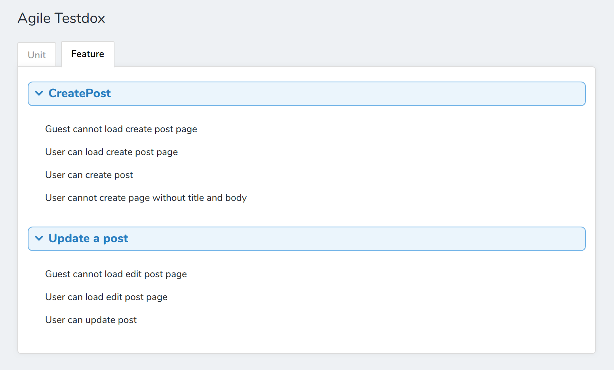

# Agile Testdox for Laravel Nova
## Description
See your [Agile Testdox] for your test as generated by PHPUnit right inside Laravel Nova!



Note: This assumes you have left `phpunit.xml` in the default place (project root) and haven't moved it.

## How it works
PHPUnit will automatically generate the Testdox for you based off the class and method names. Alternatively, you can use the `@testdox` annotation to override the generated strings, as you can see with the "Update a post" test. You can also put the annotation on test methods. See the [Agile Testdox] documentation for more.

## Installation
First, install the package:

`composer require laratutor/nova-agile-testdox`

Next, add it to the array inside the `tools()` method of your `app/Providers/NovaServiceProvider.php`:
```php
namespace App\Providers;
...
use Laratutor\NovaAgileTestdox\NovaAgileTestdox;
...

    /**
     * Get the tools that should be listed in the Nova sidebar.
     *
     * @return array
     */
    public function tools()
    {
        return [
            new NovaAgileTestdox,
        ];
    }
```

[Agile Testdox]: https://phpunit.de/manual/6.5/en/other-uses-for-tests.html
